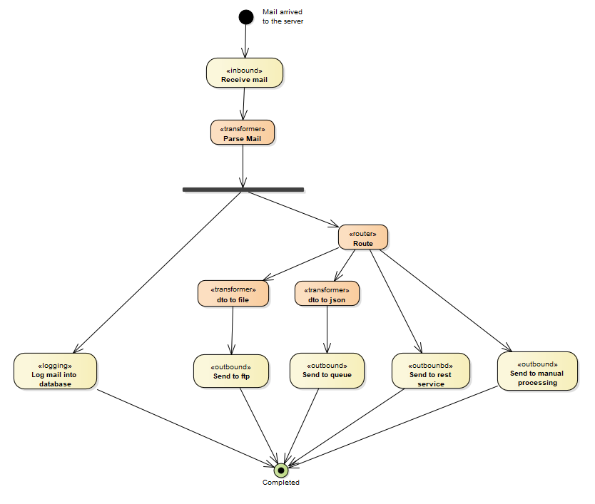
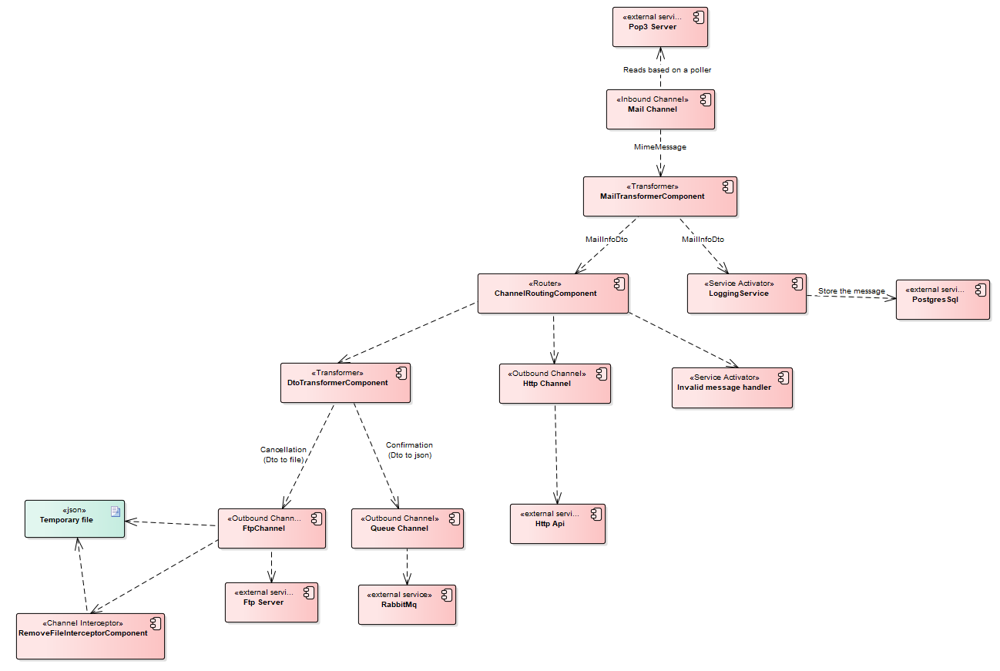

# Dsl integration demo

Example of a communication process using Spring Integration components based on dsl.

The application reads a mail server every few seconds, and process the arrived mails according to the subject:
- "Confirmation - [number]", will be sent to a rabbit exchange (app creates automatically the exchange and a binding queue to store the messages).
- "Cancellation - [number]", will be sent to a ftp folder (the uploads folder is created locally under the docker folder).
- "Info Required - [number]", will be sent to a http service.
- Any other topic, will be sent to a custom service.

The workflow is described on the following diagram:

The demo illustrates the following components:
- Pop3 inbound channel
- Ftp outbound channel
- RabbitMq outbound channel
- Http outbound channel
- Channel interceptor
- Channel router
- Message transformer
- Message handler chain
- Messaging gateway
- Service activator
- Direct and PublishSubscribeChannel channel
- Testing support

The components and the interaction are described on the following diagram:

## Instructions

You can provide your own infrastructure or use the one provided on the docker composer file. In any case you must provide your pop3 credentials, or change the faker component settings to use the fake inbound mail component (by default enabled).

    app:
        ...
        fakerEnabled: true

